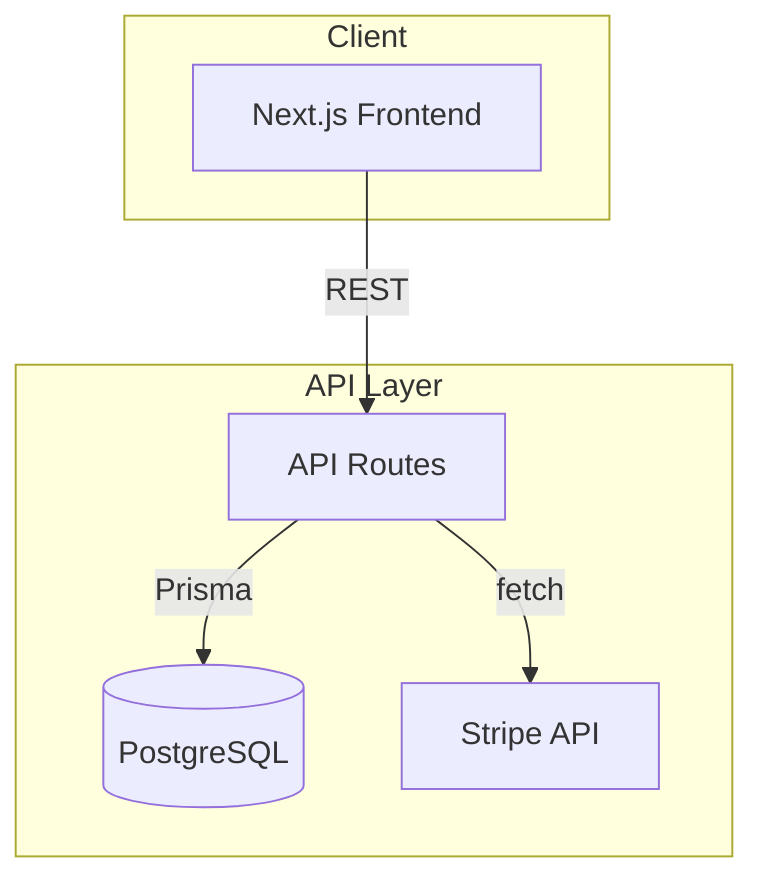

# /diagram — Claude Code Architecture Diagram Generator

Generate Mermaid diagrams from any codebase with a single command. Claude reads your actual code and produces accurate architecture, flow, ERD, sequence, dependency, and class diagrams.


## Demo

```
> /diagram architecture

Based on route handlers + Prisma schema + service layer, generating an architecture diagram.
```



## Install

### Global (all projects)

```bash
# Clone and copy
git clone https://github.com/liamc225/diagram-skill.git
cp diagram-skill/diagram.md ~/.claude/commands/diagram.md
```

### Per-project

```bash
mkdir -p .claude/commands
cp diagram-skill/diagram.md .claude/commands/diagram.md
```

## Usage

```bash
# Auto-detect best diagram type
/diagram

# Specify a type
/diagram architecture
/diagram erd
/diagram flow
/diagram sequence
/diagram dependency
/diagram class

# Scope to a directory or feature
/diagram flow src/auth
/diagram sequence checkout
/diagram erd prisma/schema.prisma
```

## Diagram Types

| Type | Best For | Detects From |
|------|----------|-------------|
| `architecture` | System overview, services, data flow | Multiple services, docker-compose, API routes |
| `erd` | Database schema visualization | ORM models, Prisma, migrations |
| `flow` | Feature logic, state machines | Complex conditionals, multi-step processes |
| `sequence` | Request lifecycle, API interactions | Route handlers calling multiple services |
| `dependency` | Module relationships, circular deps | Import/require patterns |
| `class` | OOP structure, inheritance | Class-heavy codebases |

## How It Works

This is a zero-dependency Claude Code command. No external APIs, no scripts — just a structured prompt that teaches Claude to:

1. **Recon** — scan project structure, read config files, identify the tech stack
2. **Detect** — choose the best diagram type based on codebase signals (or use what you specified)
3. **Analyze** — read actual source files to map components, relationships, and data flow
4. **Generate** — output valid Mermaid syntax following diagramming best practices
5. **Save** — write `DIAGRAM.md` to your project root
6. **Preview** — auto-opens [mermaid.live](https://mermaid.live) with your diagram pre-loaded for instant editing and export

## Viewing Diagrams

After running `/diagram`, a live preview opens automatically in your browser via mermaid.live. From there you can:

- Edit the diagram visually
- Export as PNG or SVG
- Share a link

Your diagram is also saved as `DIAGRAM.md` which GitHub renders natively — just push it.

## Examples

See the [examples/](./examples/) directory for real diagrams generated from open-source projects.

## Contributing

PRs welcome. Ideas for new diagram types, better detection heuristics, or improved Mermaid output are all fair game.

## License

MIT
