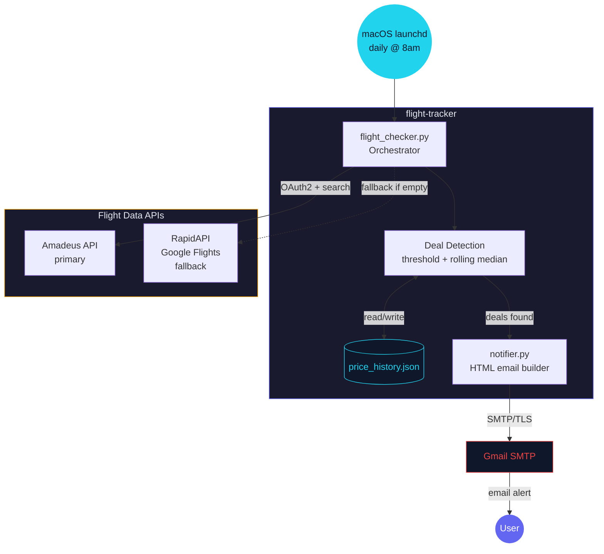

# /diagram

A Claude Code command that reads your code and generates Mermaid diagrams. Built for visualizing scripts, automations, and pipelines.


## Demo

Running `/diagram` on a Python flight deal tracker I built:



## Install

```bash
# Global (works in every project)
curl -o ~/.claude/commands/diagram.md \
  https://raw.githubusercontent.com/liamc225/diagram-skill/main/diagram.md

# Or clone the repo
git clone https://github.com/liamc225/diagram-skill.git
cp diagram-skill/diagram.md ~/.claude/commands/diagram.md
```

## How it works

1. `cd` into any project and run `/diagram`
2. Claude reads your source files — entry points, configs, imports, API calls
3. It picks the best diagram type for what it finds (or you can specify one)
4. Outputs a color-coded Mermaid diagram capped at 8-12 nodes
5. Saves `DIAGRAM.md` to the project root
6. Opens a live preview in [mermaid.live](https://mermaid.live) where you can edit and export PNG/SVG

The command is a single markdown file — no dependencies, no scripts, no API keys. It works by giving Claude structured instructions for how to analyze code and produce diagrams.

## Usage

```bash
/diagram                        # auto-detect best diagram type
/diagram architecture           # system overview with external services
/diagram flow                   # flowchart with decision points
/diagram sequence               # request lifecycle (API calls, webhooks)
/diagram erd                    # database schema from models
/diagram architecture src/api   # scope to a specific directory
```

Works best on:
- Python scripts and automation pipelines
- Cron jobs and scheduled tasks
- API integrations with external services
- Next.js / Express apps with clear route structures

## Examples

See [examples/](./examples/) for diagrams generated from real projects.

## License

MIT
