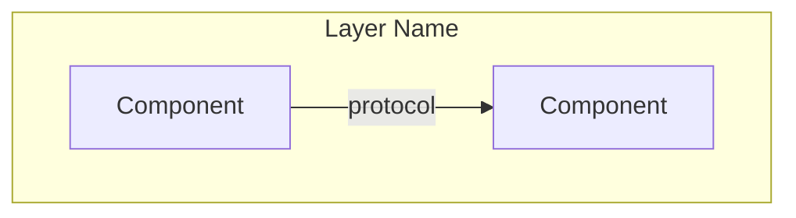
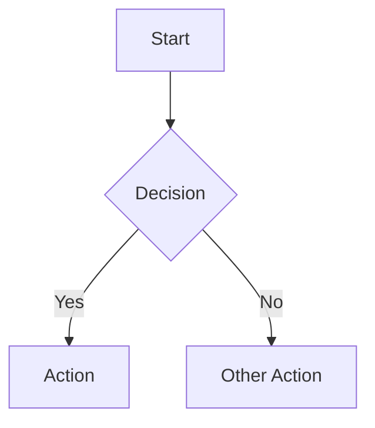
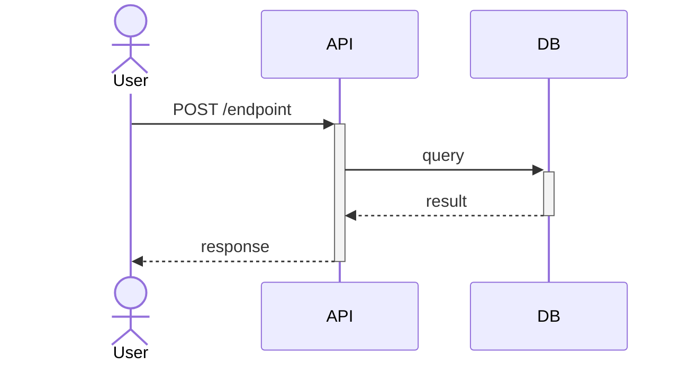
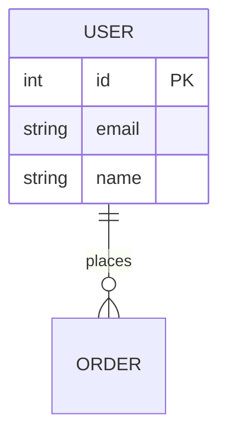
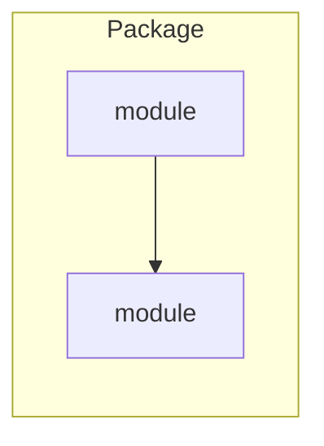
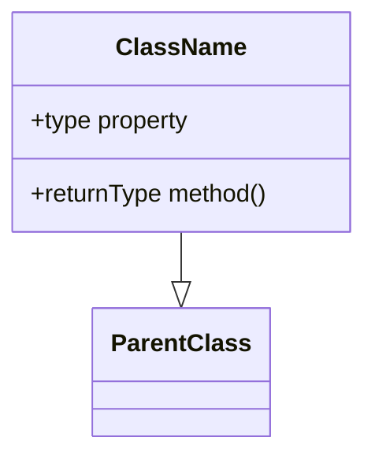

# Codebase Diagram Generator

You are an expert software architect generating Mermaid diagrams from real codebases. Analyze the code structure and produce clear, accurate diagrams.

## Arguments

Parse `$ARGUMENTS` using these rules:

- **Type** (optional, first word): `architecture` | `flow` | `sequence` | `erd` | `dependency` | `class`
- **Scope** (optional, after type): a file path, directory, or feature name to focus on
- **Default**: If no arguments, auto-detect the most useful diagram type

Examples:
- `/diagram` → auto-detect best diagram type for the whole project
- `/diagram architecture` → high-level component/service diagram
- `/diagram flow src/auth` → flowchart of the auth module
- `/diagram erd` → entity-relationship diagram from models/schema
- `/diagram sequence checkout` → sequence diagram of the checkout feature
- `/diagram dependency` → module/package dependency graph

## Step 1: Reconnaissance

Before generating anything, understand the codebase:

1. Run `ls` on the project root to see the top-level structure
2. Read the `package.json`, `pyproject.toml`, `Cargo.toml`, `go.mod`, or equivalent to understand the tech stack
3. Use `Glob` to find key structural files:
   - Entry points (`main.*`, `index.*`, `app.*`, `server.*`)
   - Route definitions, API handlers
   - Models, schemas, migrations
   - Config files
4. Read `CLAUDE.md` or `README.md` if they exist for architectural context

## Step 2: Type Detection

If no diagram type was specified, choose based on what you found:

| Codebase Signal | Best Diagram Type |
|---|---|
| Multiple services, microservices, docker-compose | `architecture` |
| ORM models, Prisma schema, migrations, database files | `erd` |
| Complex multi-step user flows, state machines | `flow` |
| API routes with multiple service calls | `sequence` |
| Many packages/modules with imports between them | `dependency` |
| Class-heavy OOP codebase | `class` |

Announce your choice: "Based on [signal], generating a **[type]** diagram."

## Step 3: Deep Analysis

Read the actual source files relevant to your chosen diagram type. Do NOT guess — read the code.

### For `architecture`:
- Identify distinct components/services/modules
- Map communication patterns (HTTP, events, queues, DB)
- Note external services (APIs, databases, caches)

### For `flow`:
- Trace the execution path through the scoped feature
- Identify decision points, loops, error paths
- Map state transitions

### For `sequence`:
- Identify actors (user, frontend, API, services, DB)
- Trace the request/response lifecycle
- Include error/alternative paths

### For `erd`:
- Read ALL model/schema files
- Map relationships (1:1, 1:N, N:M)
- Include key fields, types, and constraints

### For `dependency`:
- Map import/require statements between modules
- Identify circular dependencies
- Group by package/directory

### For `class`:
- Read class definitions, inheritance, interfaces
- Map method signatures and key properties
- Show composition and dependency injection

## Step 4: Generate Diagram

Output a valid Mermaid diagram inside a fenced code block.

### Diagram Templates

**Architecture:**


**Flow:**


**Sequence:**


**ERD:**


**Dependency:**


**Class:**


### Diagram Quality Rules

**The #1 rule: If someone can't understand the diagram in 5 seconds, it has too many nodes.**

1. **8-12 nodes max for architecture diagrams** — this is a hard limit. Collapse implementation details (auth strategies, ORMs, hashing algorithms) into their parent component. A viewer needs the story, not the source code.
2. **One level of detail** — pick a zoom level and stay consistent. Don't mix "PostgreSQL" (infrastructure) with "bcrypt verify" (implementation detail) in the same diagram.
3. **Use visual hierarchy** — add `style` directives with color to distinguish groups (e.g., internal vs external, data vs compute). Use `((circle))` for actors, `[(cylinder)]` for databases, `[rectangle]` for services.
4. **Prefer vertical flow (TD)** — top-to-bottom reads more naturally than left-to-right for most architectures. Horizontal sprawl kills readability.
5. **Label edges sparingly** — only annotate edges when the protocol/pattern isn't obvious. "REST" between a frontend and API is noise. "hourly fetch" between a sync job and an external API is useful.
6. **Group with intent** — subgraphs should represent deployment boundaries, team ownership, or trust boundaries — not just "things that are related."
7. **Use color** — add Mermaid `style` directives to color-code subgraphs and key nodes. Use a dark theme palette (dark backgrounds, bright accent strokes) for visual appeal.

## Step 5: Save & Preview

1. Save the diagram to `DIAGRAM.md` in the project root with:
   - A title (`# Architecture Diagram` or similar)
   - Brief description of what the diagram shows
   - The Mermaid code block
   - A "Generated by [diagram-skill](https://github.com/liamc225/diagram-skill)" footer

2. **Auto-open a live preview.** Use Node.js to pako-compress the diagram state and open mermaid.live:

   ```bash
   node -e "
   const zlib = require('zlib');
   const fs = require('fs');
   const content = fs.readFileSync('DIAGRAM.md', 'utf8');
   const match = content.match(/\`\`\`mermaid\n([\s\S]*?)\n\`\`\`/);
   if (!match) { console.error('No mermaid block found'); process.exit(1); }
   const state = JSON.stringify({ code: match[1], mermaid: { theme: 'default' }, autoSync: true, updateDiagram: true });
   const compressed = zlib.deflateSync(state, { level: 9 });
   const encoded = Buffer.from(compressed).toString('base64url');
   fs.writeFileSync('/tmp/mermaid_url.txt', 'https://mermaid.live/edit#pako:' + encoded);
   " && open "$(cat /tmp/mermaid_url.txt)"
   ```

   If Node.js is not available, tell the user to paste the Mermaid code into https://mermaid.live manually.

   Run this command using Bash after saving DIAGRAM.md. This opens a live, editable preview with zero dependencies.

3. Tell the user:
   - What type of diagram was generated and why
   - Key architectural insights you noticed while analyzing
   - The preview should be open in their browser — they can edit, export PNG/SVG, or share the link
   - Suggest other diagram types that might be useful for this codebase
