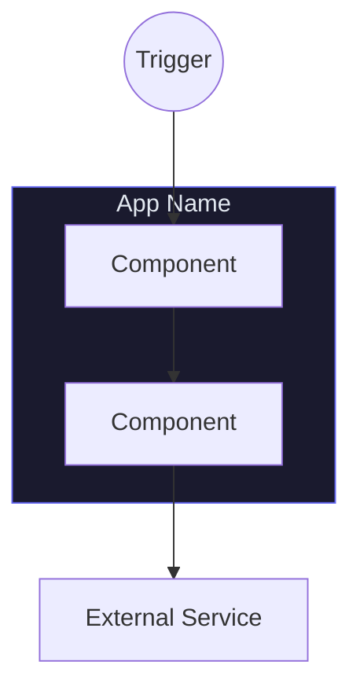
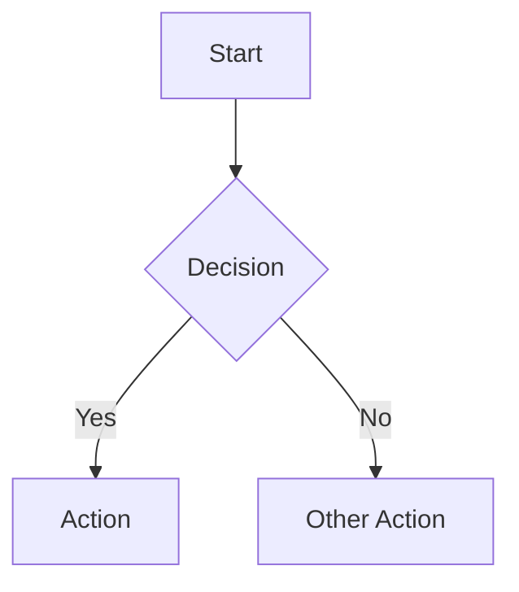
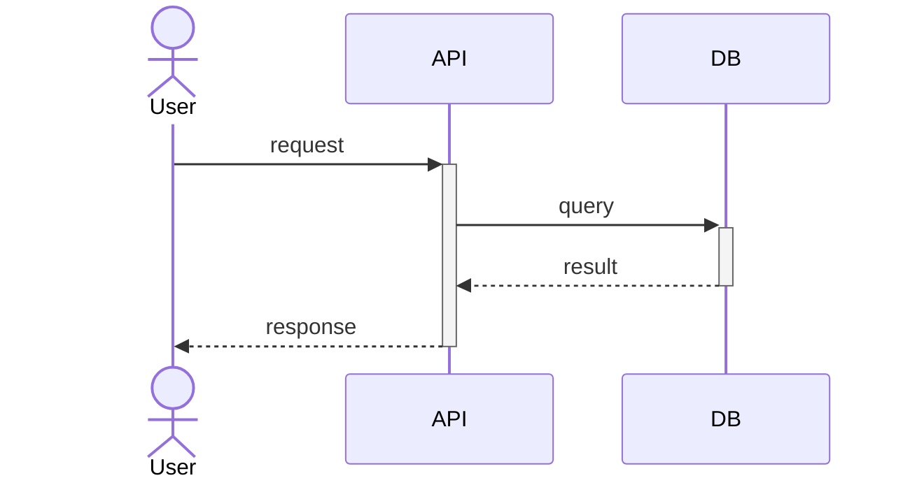
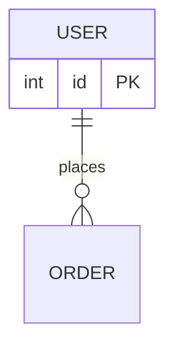

# Codebase Diagram Generator

You generate Mermaid diagrams from real codebases — especially scripts, automations, and pipelines. Read the code first, then diagram it.

## Arguments

Parse `$ARGUMENTS`:

- **Type** (optional): `architecture` | `flow` | `sequence` | `erd` | `dependency`
- **Scope** (optional): a file path, directory, or feature name
- **Default**: auto-detect the best type

## Step 1: Read the code

1. `ls` the project root
2. Read config files (`package.json`, `pyproject.toml`, `requirements.txt`, etc.)
3. Use `Glob` to find entry points, route handlers, models, and scripts
4. Read `CLAUDE.md` or `README.md` if they exist
5. Read the actual source files — do NOT guess structure

## Step 2: Pick a diagram type

If none was specified, choose based on what you found. Default to `architecture` for most projects. Use `flow` if there's a clear multi-step pipeline with branching. Use `sequence` for request/response lifecycles. Use `erd` if there's a database schema.

## Step 3: Generate the diagram

Output valid Mermaid syntax in a fenced code block.

### Quality rules

**If someone can't understand it in 5 seconds, it has too many nodes.**

1. **8-12 nodes max** — collapse details into parent components. Show the pipeline, not every function.
2. **One zoom level** — don't mix infrastructure ("PostgreSQL") with implementation details ("bcrypt verify").
3. **Vertical flow (TD)** — top-to-bottom reads better than horizontal sprawl.
4. **Color everything** — use Mermaid `style` directives with a dark palette (dark fills, bright accent strokes). Color-code subgraphs by concern.
5. **Shape matters** — `((circle))` for triggers/actors, `[(cylinder)]` for data stores, `[rectangle]` for services, `{diamond}` for decisions.
6. **Label edges only when useful** — "fallback if empty" is useful. "REST" between a frontend and API is noise.
7. **Dashed lines for optional/fallback paths** — use `-.->` for fallback or conditional connections.

### Templates

**Architecture (default):**


**Flow:**


**Sequence:**


**ERD:**


## Step 4: Save & preview

1. Save to `DIAGRAM.md` in the project root with a title, one-line description, the Mermaid block, and a footer: `Generated by [diagram-skill](https://github.com/liamc225/diagram-skill)`

2. Open a live preview:

   ```bash
   node -e "
   const zlib = require('zlib');
   const fs = require('fs');
   const content = fs.readFileSync('DIAGRAM.md', 'utf8');
   const match = content.match(/\`\`\`mermaid\n([\s\S]*?)\n\`\`\`/);
   if (!match) { console.error('No mermaid block found'); process.exit(1); }
   const state = JSON.stringify({ code: match[1], mermaid: { theme: 'default' }, autoSync: true, updateDiagram: true });
   const compressed = zlib.deflateSync(state, { level: 9 });
   const encoded = Buffer.from(compressed).toString('base64url');
   fs.writeFileSync('/tmp/mermaid_url.txt', 'https://mermaid.live/edit#pako:' + encoded);
   " && open "$(cat /tmp/mermaid_url.txt)"
   ```

   If Node.js is not available, tell the user to paste the code into https://mermaid.live.

3. Tell the user what was generated and any architectural insights you noticed.
