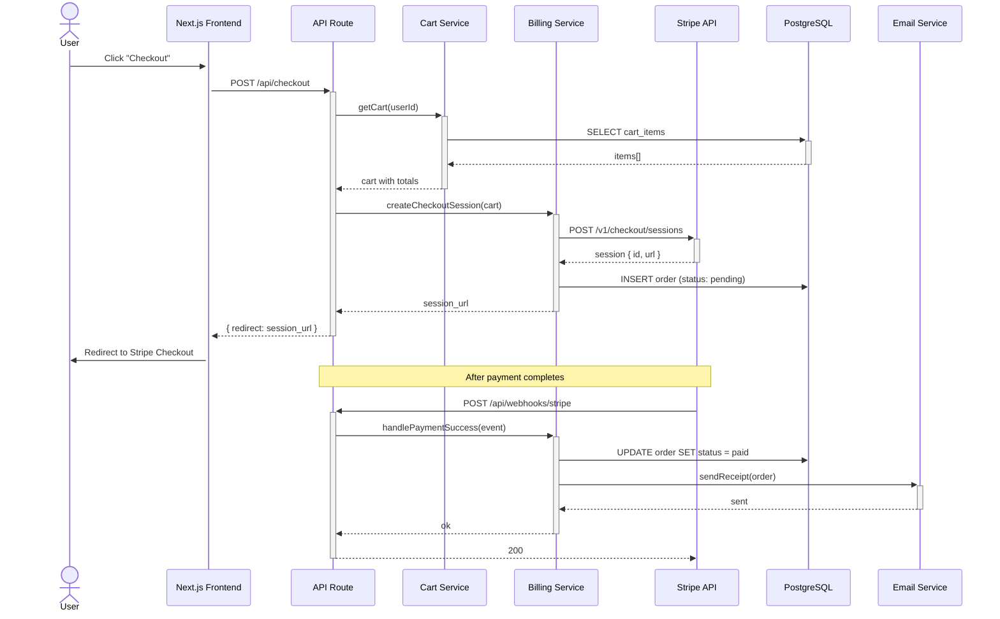

# Sequence Diagram — Checkout Flow

Auto-generated by `/diagram sequence checkout` from an API codebase with Stripe integration.

Generated by [diagram-skill](https://github.com/YOUR_USERNAME/diagram-skill)
