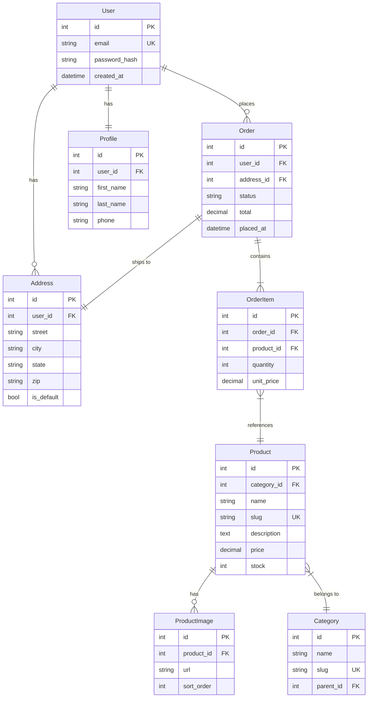

# ERD — Django E-Commerce

Auto-generated by `/diagram erd` from a Django project with typical e-commerce models.

```mermaid
erDiagram
    User ||--o{ Order : places
    User ||--o{ Address : has
    User ||--|| Profile : has
    User {
        int id PK
        string email UK
        string password_hash
        datetime created_at
    }

    Profile {
        int id PK
        int user_id FK
        string first_name
        string last_name
        string phone
    }

    Address {
        int id PK
        int user_id FK
        string street
        string city
        string state
        string zip
        bool is_default
    }

    Order ||--|{ OrderItem : contains
    Order ||--|| Address : "ships to"
    Order {
        int id PK
        int user_id FK
        int address_id FK
        string status
        decimal total
        datetime placed_at
    }

    OrderItem }|--|| Product : references
    OrderItem {
        int id PK
        int order_id FK
        int product_id FK
        int quantity
        decimal unit_price
    }

    Product ||--o{ ProductImage : has
    Product }|--|| Category : "belongs to"
    Product {
        int id PK
        int category_id FK
        string name
        string slug UK
        text description
        decimal price
        int stock
    }

    Category {
        int id PK
        string name
        string slug UK
        int parent_id FK
    }

    ProductImage {
        int id PK
        int product_id FK
        string url
        int sort_order
    }
```

Generated by [diagram-skill](https://github.com/YOUR_USERNAME/diagram-skill)
