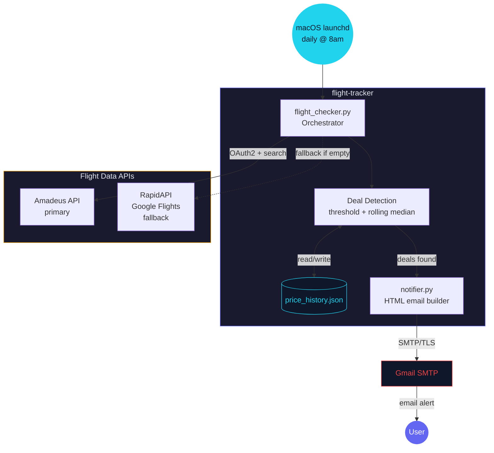

# Flight Tracker — Architecture

Daily deal finder for AUS → Ireland flights. Searches two flight APIs with automatic fallback, detects deals via price thresholds and historical trend analysis, and emails alerts.

Generated by [diagram-skill](https://github.com/liamc225/diagram-skill)
