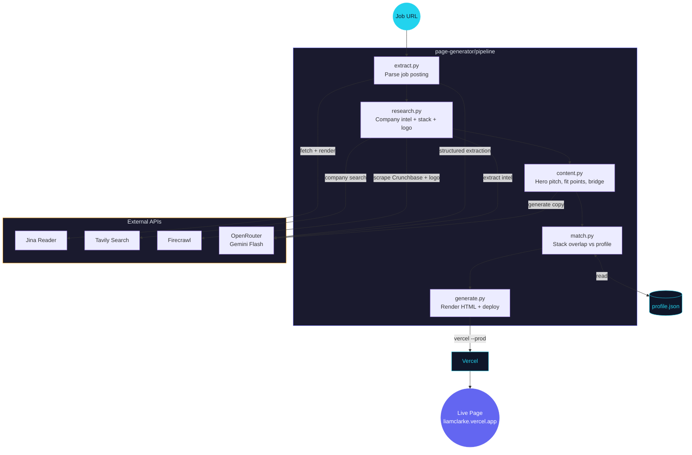

# Landing Page Generator — Architecture

5-step pipeline that takes a job posting URL, researches the company, generates personalized content, and deploys a custom landing page to Vercel.

Generated by [diagram-skill](https://github.com/liamc225/diagram-skill)
