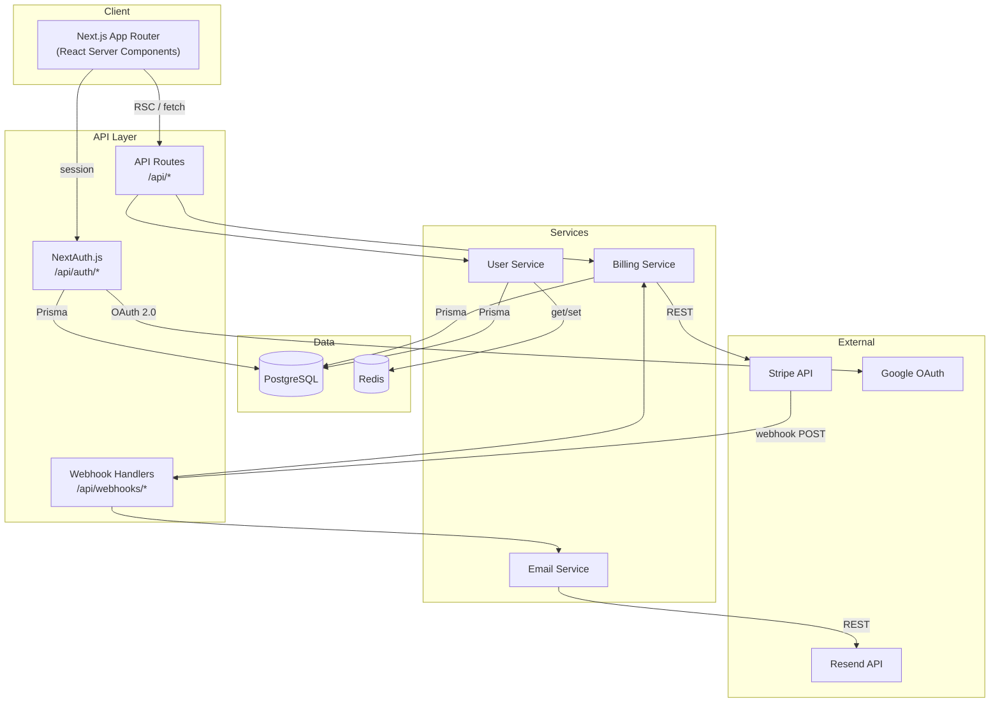

# Architecture Diagram — Next.js SaaS App

Auto-generated by `/diagram architecture` from a typical Next.js SaaS codebase with Prisma, Stripe, and NextAuth.

Generated by [diagram-skill](https://github.com/YOUR_USERNAME/diagram-skill)
